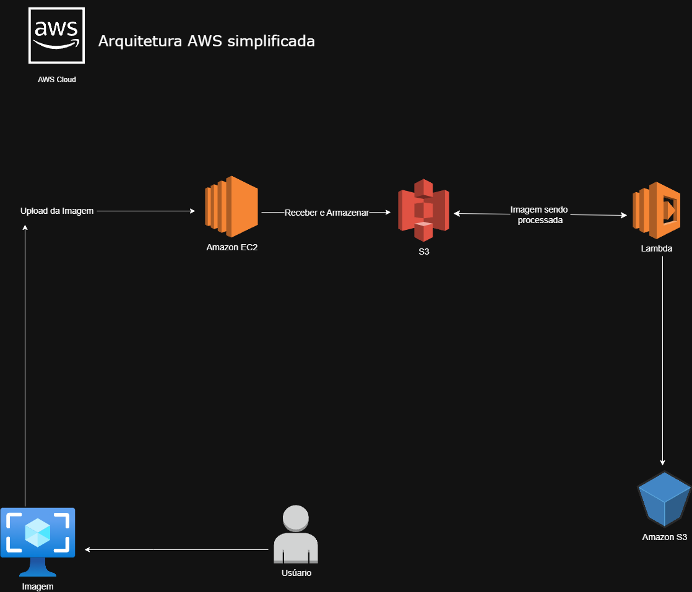

 

   

<!--Cabeçalho-->

 <h1>Bootcamp Santander Code Girls 2025 - Minha Tragetória </h1>

<!--Sobre mim--> 

 
<h3 aling="left">🙋‍♀️ Sobre mim:</h3>

  Olá! Eu sou a <strong>Letícia Martuscelli de Moraes</strong>, estudante de
  <strong>Análise e Desenvolvimento de Sistemas</strong>. 
  Apaixonada por tecnologia e em constante aprendizado. 
  Estudando <strong>Cloud</strong> com foco em <strong>AWS</strong> e documentando
  meus aprendizados e desafios.

 <!--Desenvolvimento do repositório-->

<h3 aling="left">🎯 Objetivo:</h3>

 ◦ Documentar aprendizado. 
 ◦ Consolidar conhecimentos em AWS com labs práticos. 
 ◦ Manter um portfólio público e organizado que evidencie minha evolução em AWS.

### Arquitetura AWS criada

   
  <em>Usuário → EC2 → S3 (entrada) → Lambda → S3 (processadas)</em>

<h3 aling="left"> Vantagens de Cada Serviço:</h3>

◦ <strong>Amazon EC2:</strong> recebe a imagem no upload e pode realizar validações iniciais. Vantagem → dá flexibilidade para rodar aplicações personalizadas e ter controle sobre o ambiente.

◦ <strong>Amazon S3:</strong> armazena a imagem original e a processada. Vantagem → armazenamento altamente escalável, seguro e com custo baixo.

◦ <strong>AWS Lambda:</strong> processa a imagem automaticamente quando detecta novos arquivos no S3. Vantagem → não precisa gerenciar servidores, paga apenas pelo uso e escala conforme a demanda.

◦ <strong>Usuário:</strong> acessa o resultado final de forma simples, sem precisar se preocupar com a infraestrutura por trás.

<h3 aling="left"> Ferramentas e Tecnologia</h3>

  <!-- AWS -->
  
  
  <!-- HTML -->
  
  
  <!-- Amazon S3 -->
  
  
  <!-- AWS Lambda -->
  
  
  <!-- Amazon EC2 -->
  
  
  
  <!-- GitHub -->
  
  
  <!-- VS Code -->
  

